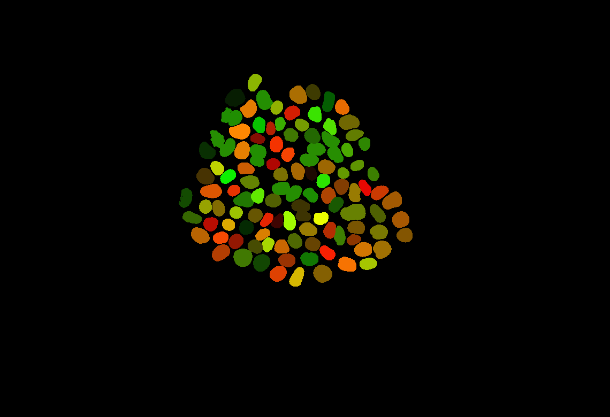

# Nucmorph-Colorizer Data Format

Nucmorph-Colorizer can only load datasets that follow the defined data specification.

The easiest way to get started is to modify one of our existing data processing scripts, like [`convert_nucmorph_data.py`](../scripts/timelapse-colorizer-data/convert_nucmorph_data.py)!

(Check with your team or one of the developers on the Animated Cell team to see if there's already a data generation script for your project!)

## Terms

Here are a few important terms:

- **Dataset**: A dataset is a single time-series, and can have any number of tracked objects and features.
- **Collection**: An arbitrary grouping of datasets.
- **Object ID**: Every segmentation object in every frame has an integer identifier that is unique across all time steps. This identifier will be used to map an object to relevant data. Object IDs must be sequential, starting from 0, across the whole dataset.

## Dataset

A dataset consists of a group of files that describe the segmentations, tracks, feature data, processed images, and additional metadata for a single time-series.

The most important file is the **manifest**, which is a JSON file that describes all the files in the dataset. (Manifests should be named `manifest.json` by default.)

```
--manifest.json--
{
    "frames": [
        <relative path to image frame 0>,
        <relative path to image frame 1>,
        ...
    ],
    "features": {
        <feature name 1>: <relative path to feature JSON>,
        <feature name 2>: <relative path to feature JSON>,
        ...
    },
    "tracks": <relative path to tracks JSON>,
    "times": <relative path to times JSON>,
    "outliers": <relative path to outlier JSON>,    //< optional
    "centroids": <relative path to centroids JSON>, //< optional
    "bounds": <relative path to bounds JSON>        //< optional
}


*Note: all paths are relative to the location of the manifest file.
```

Note that the `outliers`, `centroids`, and `bounds` files are optional, but certain features of Nucmorph-Colorizer won't work without them.

A complete example dataset is also available in the [`documentation`](./example_dataset) directory of this project, and can be [viewed on Nucmorph Colorizer](https://dev-aics-dtp-001.int.allencell.org/nucmorph-colorizer/dist/?dataset=https://raw.githubusercontent.com/allen-cell-animated/nucmorph-colorizer/main/documentation/example_dataset/manifest.json).

<details>
<summary><b>[Show me an example!]</b></summary>

---

An example dataset directory could look like this:

```
📂 my_dataset/
  - 📄 manifest.json
  - 📄 outliers.json
  - 📄 tracks.json
  - 📄 times.json
  - 📄 centroids.json
  - 📄 bounds.json
  - 📕 feature_0.json
  - 📗 feature_1.json
  - 📘 feature_2.json
  - 📁 frames/
    - 📷 frame_0.png
    - 📷 frame_1.png
    - 📷 frame_2.png
    ...
    - 📷 frame_245.png
```

The `manifest.json` file would look something like this:

```
--manifest.json--
{
    "frames": [
        "frames/frame_0.png",
        "frames/frame_1.png",
        "frames/frame_2.png",
        ...
        "frames/frame_245.png",
    ],
    "features": {
        "My Cool Feature": "feature_0.json",
        "Another Cool Feature": "feature_1.json",
        "The Coolest Feature": "feature_2.json",
    },
    "tracks": "tracks.json",
    "times": "times.json",
    "outliers": "outliers.json",
    "centroids": "centroids.json",
    "bounds": "bounds.json"
}
```

---

</details>

### 1. Tracks

Every segmented object in each time step has an **object ID**, an integer identifier that is unique across all time steps. To recognize the same object across multiple frames, these object IDs must be grouped together into a **track** with a single **track number/track ID**.

A **track JSON file** consists of a JSON object with a `data` array, where for each object ID `i`, `data[i]` is the track number that object is assigned to.

```
--tracks.json--
{
    "data": [
        <track number for id 0>,
        <track number for id 1>,
        <track number for id 2>,
        ...
    ]
}
```

<details>
<summary><b>[Show me an example!]</b></summary>

---

For example, if there were the following two tracks in some dataset, the track file might look something like this.

| Track # | Object IDs |
| ------- | ---------- |
| 1       | 0, 1, 4    |
| 2       | 2, 3, 5    |

Note that the object IDs in a track are not guaranteed to be sequential!

```
--tracks.json--
{
    "data": [
        1, // 0
        1, // 1
        2, // 2
        2, // 3
        1, // 4
        2  // 5
    ]
}
```

---

</details>

### 2. Times

The times JSON is similar to the tracks JSON. It also contains a `data` array that maps from object IDs to the frame number that they appear on.

```
--times.json--
{
    "data": [
        <frame number for id 0>,
        <frame number for id 1>,
        <frame number for id 2>,
        ...
    ]
}
```

### 3. Frames

_Example frame:_

_Each unique color in this frame is a different object ID._

**Frames** are image textures that store the object IDs for each time step in the time series. Each pixel in the image can encode a single object ID in its RGB value (`object ID = R + G*256 + B*256*256 - 1`), and background pixels are `#000000` (black).

Additional notes:

- Encoded object ID's in the frame data start at `1` instead of `0`, because `#000000` (black) is reserved for the background.
- The highest object ID that can currently be represented is `16,843,007`.
  - If the **total number of segmented objects** for an entire time series exceeds this number, it is possible to remove this limit. [Submit an issue](https://github.com/allen-cell-animated/nucmorph-colorizer/issues) or send us a message!

There should be one frame for every time step in the time series, and they must all be listed in order in the **manifest** file to be included in the dataset.

<details>
<summary><b>[Show me an example!]</b></summary>

---

Let's say we have a simple 3x3 image, and the center pixel is mapped to the object ID `640` surrounded by the background.

The calculation for the RGB value would follow this process.

1. Add one to the object ID, because of 1-based indexing. (`ID = 641`)
2. Get the Red channel value. (`R = ID % 256 = 641 % 256 = 129`)
3. Get the Green channel value. (`G = ⌊ID / 256⌋ % 256 = 1 % 256 = 2`)
4. Get the Blue channel value. (`B = ⌊ID / (256^2)⌋ = ⌊641 / (256^2)⌋ = 0`)

The RGB value for ID `640` will be `RGB(129, 2, 0)`, or `#810200`.

The resulting frame would look like this:


---

</details>

### 4. Features

Datasets can contain any number of `features`, which are a numeric value assigned to each object ID in the dataset. Features are used by the Nucmorph-Colorizer to colorize objects, and each feature file corresponds to a single column of data. Examples of relevant features might include the volume, depth, number of neighbors, age, etc. of each object.

Features include a `data` array, specifying the feature value for each object ID, and should also provide a `min` and `max` range property.

```
--feature1.json--
{
    "data": [
        <feature value for id 0>,
        <feature value for id 1>,
        <feature value for id 2>,
        ...
    ],
    "min": <min value for all features>,
    "max": <max value for all features>
}
```

### 5. Centroids (optional)

The centroids file defines the center of each object ID in the dataset. It follows the same format as the feature file, but each ID has two entries corresponding to the `x` and `y` coordinates of the object's centroid, making the `data` array twice as long.

For each index `i`, the coordinates are `(x: data[2i], y: data[2i + 1])`.
Coordinates are defined in pixels in the frame, where the upper left corner of the frame is (0, 0).

```
--centroids.json--
{
    "data": [
        <x coordinate for id 0>,
        <y coordinate for id 0>,
        <x coordinate for id 1>,
        <y coordinate for id 1>,
        ...
    ]
}
```

### 6. Bounds (optional)

The bounds file defines the rectangular boundary occupied by each object ID. Like centroids and features, the file defines a `data` array, but has four entries for each object ID to represent the `x` and `y` coordinates of the upper left and lower right corners of the bounding box.

For each object ID `i`, the minimum bounding box coordinates (upper left corner) are given by `(x: data[4i], y: data[4i + 1])`, and the maximum bounding box coordinates (lower right corner) are given by `(x: data[4i + 2], y: data[4i + 3])`.

Again, coordinates are defined in pixels in the image frame, where the upper left corner is (0, 0).

```
--bounds.json--
{
    "data": [
        <upper left x for id 0>,
        <upper left y for id 0>,
        <lower right x for id 0>,
        <lower right y for id 0>,
        <upper left x for id 1>,
        <upper left y for id 1>,
        ...
    ]
}
```

### 7. Outliers (optional)

The outliers file stores whether a given object ID should be marked as an outlier using an array of booleans (`true`/`false`). Indices that are `true` indicate outlier values, and are given a unique color in Nucmorph-Colorizer.

```
--outliers.json--
{
    "data": [
        <whether id 0 is an outlier>,
        <whether id 1 is an outlier>,
        <whether id 2 is an outlier>,
        ...
    ]
}
```

<details>
<summary><b>[Show me an example!]</b></summary>

---

For example, if a dataset had the following tracks and outliers, the file might look something like this.

| Track # | Object IDs | Outliers |
| ------- | ---------- | -------- |
| 1       | 0, 1, 4    | 1        |
| 2       | 2, 3, 5    | 2, 5     |

```
--outliers.json--
{
    "data": [
        false, // 0
        true,  // 1
        true,  // 2
        false, // 3
        false, // 4
        true   // 5
    ]
}
```

---

</details>

## Collections

Collections are defined by an optional JSON file and group one or more datasets for easy access. Nucmorph-Colorizer can parse collection files and present its datasets for easier comparison and analysis from the UI.

By default, collection files should be named `collection.json`.

Collections are an array of JSON objects, each of which define the `name` (an **alias**) and the `path` of a dataset. This can either be a relative path from the location of the collection file, or a complete URL.

If the path does not define a `.json` file specifically, Nucmorph-Colorizer will assume that the dataset's manifest is named `manifest.json` by default.

```
--collection.json--
[
    { "name": <some_name_1>, "path": <some_path_1>},
    { "name": <some_name_2>, "path": <some_path_2>},
    ...
]
```

<details>
<summary><b>[Show me an example!]</b></summary>

---

For example, let's say a collection is located at `https://example.com/data/collection.json`, and the `collection.json` contains this:

```
--collection.json--
[
  { "name": "Mama Bear", "path": "mama_bear" },
  { "name": "Baby Bear", "path": "nested/baby_bear" },
  { "name": "Babiest Bear", "path": "babiest_bear/dataset.json" },
  { "name": "Goldilocks", "path": "https://example2.com/files/goldilocks" },
  { "name": "Papa Bear", "path": "https://example3.com/files/papa_bear.json"}
]
```

Here's a list of where Nucmorph-Colorizer will check for the manifest files for all of the datasets:

| Dataset      | Expected URL Path                                         |
| ------------ | --------------------------------------------------------- |
| Mama Bear    | `https://example.com/data/mama_bear/manifest.json`        |
| Baby Bear    | `https://example.com/data/nested/baby_bear/manifest.json` |
| Babiest Bear | `https://example.com/data/babiest_bear/dataset.json`      |
| Goldilocks   | `https://example2.com/files/goldilocks/manifest.json`     |
| Papa Bear    | `https://example3.com/files/papa_bear.json`               |

---

</details>
